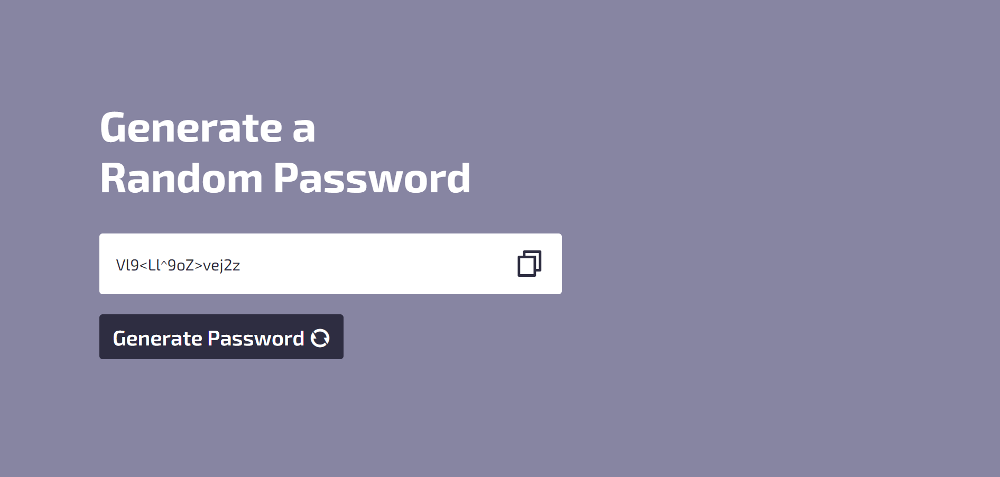

# Secure Password Generator

## Description

This JavaScript project generates strong, secure passwords that are tailored to your desired length and complexity. It offers a user-friendly interface with the following features:

### Random Password Generation

Click the "Generate Password" button to create a new, unique password.

### Customizable Length

The password length is set to 16 characters by default, but you can easily modify this value in the code for different levels of security.

### Character Set Selection

The password includes a mix of uppercase letters, lowercase letters, numbers, and symbols by default. You can adjust the character sets included in the generated passwords to match your specific security requirements.

### Copy to Clipboard

Click the "Copy Password" button to effortlessly copy the generated password to your clipboard, allowing you to easily paste it into your password manager or other applications.

### Stylish Design (Optional)

The project includes basic CSS styling to enhance the user interface (commented out by default).

## Getting Started

### Clone or Download the Project

Clone this repository using Git or download the zip archive.

### Open the HTML File

Open the `index.html` file in a web browser (e.g., Chrome, Firefox).

## Usage

### Generate a Password

Click the "Generate Password" button. This will create a new, random password based on the current settings.

### View Password

The generated password will be displayed in the password input field.

### Copy Password

Click the "Copy Password" button to copy the displayed password to your clipboard.

### Customizing Length

Modify the `lengthOfPassword` variable in the JavaScript code to adjust the default password length.

### Selecting Character Sets

Adapt the character sets used within the `allChars` and `charSets` variables to control the types of characters included in the generated passwords.

### Enabling Styles (Optional)

Uncomment the CSS section in the `style.css` file (or create a new CSS file) to apply the provided styles to your password generator.

## Technologies Used

- **HTML**: Defines the basic structure and elements of the user interface.
- **CSS**: Provides optional styling for the user interface (commented out by default).
- **JavaScript**: Handles the logic for generating and copying passwords.

## Additional Notes

- For enhanced security, consider storing passwords using a secure password manager instead of plain text files.
- Regularly update your passwords to maintain the integrity of your accounts.

## Example Usage

1. Open the `index.html` file in your web browser.
2. Click the "Generate Password" button.
3. A random password will be displayed in the password input field.
4. Click the "Copy Password" button to copy the password to your clipboard.

## Contributing

Feel free to fork this repository and make contributions. Please create pull requests for any changes or enhancements you wish to share.
